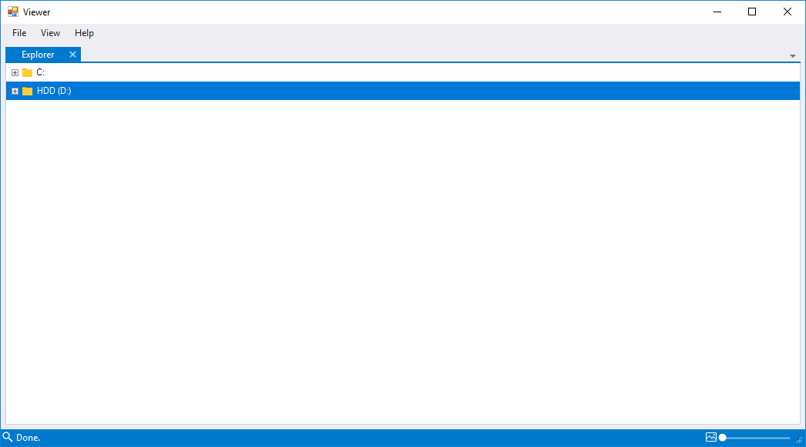
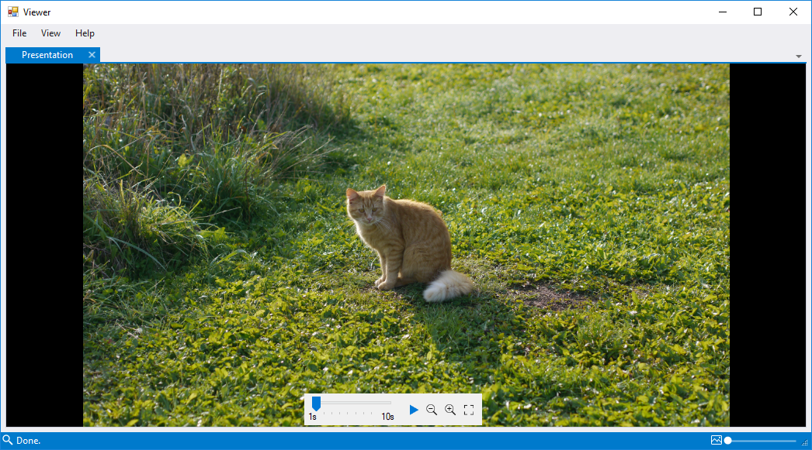
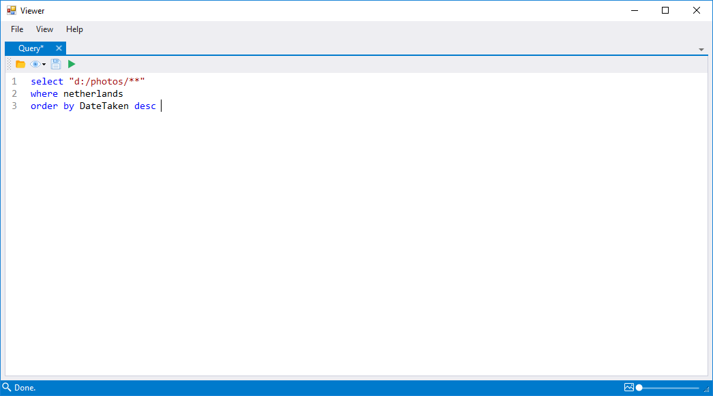

# UI overview

This is a screenshot of the application. 

It contains many windows. You can resize, move, hide or close all windows. Lets have a look at some of the components.

## Thumbnail Grid

Result of a query is shown in the window labeled `Images`. To open it, select a directory in the [Explorer window](#explorer) or execute a query in a [Query editor](#query-editor). 

It shows a grid of photo thumbnails. The thumbnail grid works very simillar to Windows File Explorer:

- double click on a thumbnail to open a [Presentation](#presentation)
- select images using mouse pointer (use left mouse button over an empty space and drag the mouse cursor) 
- hold the left `Ctrl` key to switch the selection to symetric difference mode. If you start a new selection in this mode, previously selected images won't be removed. Instead, if an image has already been in the selection and you select it again, it will be removed.
- hold the left `Shift` key to switch the selection to union mode. In this mode, if you start a new selection, the previously selected images won't be removed. All newly selected images will be added to the selection.
- Copy (`Ctrl + C`), cut (`Ctrl + X`), rename (`F2`) and delete (`Delete`) files using shortcuts or the context menu opened by right clicking anywhere in the window. 
- All queries are kept in a history collection. You can browse the history using the context menu or shortcuts (`Alt + Left Arrow` or `Mouse Button 4` to go to the previous query and `Alt + Right Arrow` or `Mouse Button 5` to go to the next query)

Size of thumbnails can be changed using the thumbnail size slider shown in the bottom right corner of the application (in the status bar). 

Looking at the status bar, there are 3 more labels. Label on the left shows status of the current query. Since we have already found all photos, it just says "Done." Labels on the right show the number of selected items and the total number of items in the grid.

## Attributes

When you select photos in the application, all their attributes are shown in windows labeled `Exif` and `Attributes` (top right in the image). `Exif` contains read-only tags parsed from the Exif segment. `Attributes` contains editable attributes saved in a custom attributes segment. You can edit these attributes for all selected photos and save all modifications using the save button shown in the bottom right corner of the `Attributes` window.

## Explorer

You can easily navigate through the local files in the window labeled `Explorer`. Open it using the application menu: `View` → `Explorer`

The explorer component is a tree view with all local folders. Clicking on a folder in this tree view will execute a query `SELECT "path_to_the_folder"` which opens content of this directory in the [Thumbnail Grid window](#thumbnail-grid). Double clicking on a folder in this view will reveal all its subfolders.

## Presentation 

You can view all your photos in the `Presentation` window. Open the window by double clicking on an item in the [Thumbnail Grid](#thumbnail-grid). 

Presentation shows photos one by one scaled down to the window size. Pointing your cursor to the bottom of this window will open a control panel as seen in the picture above. You can start presentation (`space`), set presentation speed and zoom in (`Ctrl + Mouse Wheel Up`) and out (`Ctrl + Mouse Wheel Down`) using this control panel. Additionaly, a fullscreen presentation can be opened (`F5`). 

You can manually go through the presentation. Move your mouse cursor to the left or the right edge of the window and a button will show up. Use these buttons to move forward/backward in the presentation or use `Mouse Wheel Down` to go backward and `Mouse Wheel Up` to go forward. 

## Query Editor

The window labeled `Query` contains a viewer query. Open the window using the application menu: `View` → `Query`.

 Queries can be executed (`F5`, or click on the  button), loaded from a file (`Ctrl + O`, or click on the ) or saved (`Ctrl + S`, or click on the  button).

 Queries saved in a special directory (`%userprofile%/Documents/Viewer/Views` by default) are treated as views. You can see all query views by clicking on the  button. File name of a view can be used instead of a path pattern in the `select` part of a query. See [Query Language](query.md) for more information about query syntax. 
